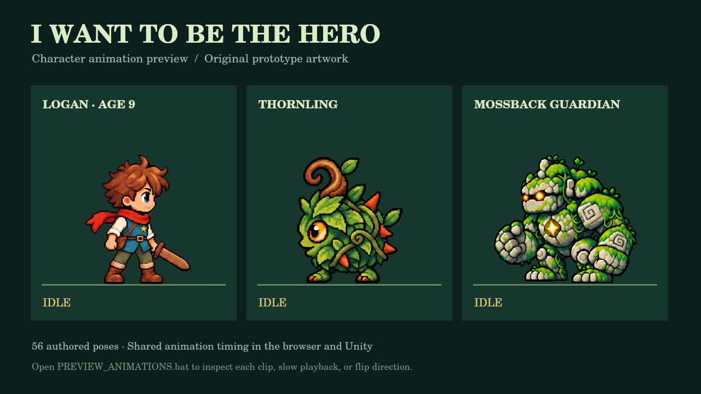

# I Want to Be the Hero

A short, child-friendly pixel-art action-platformer prototype starring Logan, an original fictional nine-year-old hero.

Logan enters the Sunleaf Ruins looking for the Hero Spark. Finding it unlocks his dash and opens the ancient gate. Beyond the gate, the Mossback Guardian tests whether Logan has the courage to become a hero.

## Play immediately

Extract the complete ZIP first. On Windows, double-click `PLAY_BROWSER.bat`.

Open `web/index.html` in Chrome, Edge, Firefox, or Safari. The web prototype is self-contained and does not require installation or an internet connection.

For a local web server, run one of these commands from the `web` folder:

```bash
python -m http.server 8080
```

```bash
npx serve .
```

Then open `http://localhost:8080`.

## Controls

| Action | Keyboard | Controller | Tablet |
| --- | --- | --- | --- |
| Move | A/D or arrows | Left stick/D-pad | Left/right buttons |
| Jump | Space, W or Up | A / Cross | Jump button |
| Attack | J or X | X / Square | Hit button |
| Hero Dash | Shift or K | B / Circle | Dash button |
| Pause | Escape | — | Pause button |
| Restart | R | — | Play again after victory |

The Hero Dash becomes available after Logan finds the Hero Spark. Pause controls apply to the browser version; Unity does not yet include an in-game pause menu.

## Prototype contents

- Responsive movement with coyote time, jump buffering and variable jump height.
- Melee combat with five Thornling enemies.
- Hero Spark power-up and dash unlock.
- Mid-level checkpoint and automatic respawn.
- Mossback Guardian boss with telegraphed charge attacks and a faster second phase.
- Keyboard, gamepad and tablet touch input.
- Responsive 16:9 layout with a tablet landscape notice.
- Original generated pixel-art character, enemy, boss and environment artwork.
- 56 animation poses across Logan, the Thornling and the Mossback Guardian.
- Timed sword wind-up, impact and recovery; dash afterimages; readable hurt and defeat poses.
- Small synthesized sound effects in the browser build; no external audio files.

## Character animations



Double-click `PREVIEW_ANIMATIONS.bat`, or open `web/animation-preview.html`. Choose a character, slow playback, pause, or flip the facing direction. The viewer works offline and uses the same renderer as the game.

| Character | Poses | Animations |
| --- | --- | --- |
| Logan | 24 | Idle, run, jump rise/apex/fall, landing, sword attack, dash, hurt, victory |
| Thornling | 16 | Idle, walk, lunge, hurt, defeat |
| Mossback Guardian | 16 | Idle, charge warning, charge, hurt, defeat |

To edit timing, change `web/assets/animations/manifest.json`, then run `node tools/sync-animation-data.cjs`. It updates both the browser data file and the Unity resource. Source PNGs stay editable, and custom frame rectangles and foot pivots compensate for the generated sheets' uneven spacing. See `ANIMATION_NOTES.md` for integration details and verification limits.

## Unity 6.3 project

1. Open Unity Hub.
2. Choose **Add project from disk** and select the `unity` folder.
3. Open it with **Unity 6.3 / 6000.3.x**.
4. Open `Assets/Scenes/Main.unity`.
5. Press Play.

The scene is intentionally empty. `PrototypeBootstrap` constructs the complete level, characters, physics and interface at runtime, so there are no fragile prefab or inspector references. Unity will generate any missing `.meta` and project-cache files on first import.

**Unity 2019.4 is not supported.** The earlier `CS8124` and `new expression requires...` errors come from opening this source with that older C# compiler; it also lacks APIs used by this project. Select Unity 6.3 in Unity Hub, or play the browser version without Unity.

The Unity Editor was unavailable during this update. Unity source and resource references were inspected, but its first import, compile, and Play Mode test still need to happen in Unity 6.3. Browser animation and gameplay behavior have automated tests, plus local Canvas rendering checks; a full browser and tablet playtest is still needed.

## Project structure

```text
I-Want-To-Be-The-Hero/
├── web/                         Playable HTML5 Canvas build
│   ├── assets/                  Pixel-art PNG files
│   ├── game.js                  Complete game loop
│   ├── animations.js            Shared animation playback and drawing
│   ├── animation-preview.html   Interactive character animation viewer
│   ├── index.html               Game shell and menus
│   └── styles.css               Responsive and touch UI
├── unity/                       Unity 6.3 source project
│   ├── Assets/Resources/Art/    Shared pixel-art PNG files
│   ├── Assets/Scenes/           Bootstrap scene
│   └── Assets/Scripts/          Gameplay and UI source
├── ART_GENERATION_NOTES.md      Asset prompts and constraints
├── ANIMATION_NOTES.md           States, timing and editing guide
├── tests/                       Gameplay and animation regression tests
├── tools/                       Data sync and optional rendering tools
├── PLAY_BROWSER.bat             Windows game launcher
└── PREVIEW_ANIMATIONS.bat        Windows animation viewer launcher
```

## Verify changes

With Node.js installed, run `node --test tests/animations.test.cjs`. The tests need no npm dependencies and cover frame timing, atlas bounds, shared browser/Unity data, attack damage windows, jumping, dash unlock and trails, pause, hurt, respawn, defeat and victory.

## First playtest questions

1. Can a new player understand that the Hero Spark unlocks the gate?
2. Does Logan's jump feel responsive rather than slippery?
3. Is the boss charge clearly telegraphed for a younger player?
4. Are the tablet buttons large enough without covering important action?
5. Does the final message make the theme—courage and trying again—clear?

## Suggested next production step

Next, playtest the movement and combat, refine the generated animation poses by hand, build a proper tilemap, add controller rebinding and music, and validate Android/iPad builds. The sheets are prototype artwork; some pose details and limb positions still vary between frames.
