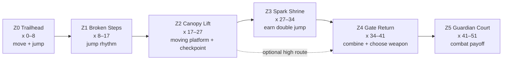

# Sunleaf Ruins Demo — Literature-Led Level Plan

**Revision:** 1.0 — 14 September 2026
**Purpose:** Convert the game-design library into a buildable map for one visually strong, replayable 2D platformer demo.
**Current implementation:** `Main` spans roughly x=0–51 with six ground masses, ten ledges, five hazards, a checkpoint, the Hero Spark, a gate, and the Mossback Guardian arena.

## The design promise

The demo should make the player feel that Logan becomes more capable through courage and practice. Its five-minute arc is:

> **Learn → risk → recover → earn the Hero Spark → express mastery → prove courage.**

The environment teaches through shape, sight line, and consequence. Text may confirm a lesson, but the geometry should teach it first. Every demanding jump must have a readable takeoff, a visible landing, a predictable penalty, and a quick return to control.

## What the literature changes

| Decision for this demo | Evidence brought together | Consequence for the level |
|---|---|---|
| Teach one verb in safety, test it with light pressure, combine it later. | [Game Design Workshop](035-game-design-workshop-a-playcentric-approach-to-creating-tracy-fullerton-game-design-workshop-fourth-2018-a-k-p.md), [The Gamer's Brain](072-the-gamers-brain-how-neuroscience-and-ux-can-impact-video-celia-hodent-2026-crc-press-isbn13-9781032058573-456.md), and [Level Up](052-level-up-the-guide-to-great-video-game-design-scott-a-rogers-z-library-sk-1lib-sk-z-lib-sk.md) emphasize player goals, learning by doing, feedback, and playtesting. | Each zone introduces at most one required idea. The first mandatory route never requires the backflip. |
| Spatial composition should reveal intent before execution. | [An Architectural Approach to Level Design](007-an-architectural-approach-to-level-design-christopher-w-totten-z-library-sk-1lib-sk-z-lib-sk.md), [Level Design: Processes and Experiences](051-level-design-processes-and-experiences-christopher-w-totten-z-library-sk-1lib-sk-z-lib-sk.md), and [The Art of Game Design](067-the-art-of-game-design-a-book-of-lenses-schell-jesse-schell-jesse-1-us-2008-morgan-kaufmann-publishers-isbn13-.md) connect sight lines, spatial types, player behavior, constraints, and indirect control. | The camera shows the next landing or landmark before Logan commits. Optional routes are framed above the main route. |
| Tune movement using measurable response, space, and perception. | [Game Feel](040-game-feel-a-game-designer-s-guide-to-virtual-sensation-steve-swink-morgan-kaufmann-game-design-books-2008-morg.md) breaks feel into input, response, context, space, and polish; [The Design of Everyday Things](059-norman-2013-the-design-of-everyday-things.md) stresses discoverability, constraints, and feedback. | Platform dimensions are derived from tested jump envelopes. Input feedback is immediate; decoration never hides collision edges. |
| Challenge must support competence instead of creating opaque punishment. | [Flow](015-cziksentmihalyi-flow-the-psychology-of-optimal-experience.md), [GameFlow](042-gameflow-a-model-for-evaluating-player.md), the [failure-response study](008-anderson-2020-hits-quits-and-retries-player-response-to-failure-in-a-challenging-video-game.md), the [persistence study](009-anderson-et-al-2019-building-persistence-through-failure-the-role-of-challenge-in-video-games.md), and [Self-Determination Theory](089-self-determination-theory-basic-psychological-needs-in-ryan-richard-m-deci-edward-l-feb-14-2017-the-guilford-p.md) link clear goals, balanced challenge, competence, autonomy, and persistence. | Checkpoint before the hardest chain, fast respawn, visible cause of failure, and an optional mastery path for autonomy. |
| Mechanics need meaningful choices and readable system relationships. | [Rules of Play](048-katie-salen-eric-zimmerman-rules-of-play-game-design-fundamentals.md), [MDA](056-mda-a-formal-approach-to-game-design-and-game-research.md), [Game Mechanics](041-game-mechanics-advanced-game-design-adams-ernest-dormans-joris-z-library-sk-1lib-sk-z-lib-sk.md), and [Advanced Game Design](085-advanced-game-design-a-systems-approach-a-systems-approach-michael-sellers-1-us-2017-addison-wesley-profession.md) frame play as choices inside connected systems. | Sword and wand solve different spatial problems; neither is a cosmetic reskin. |
| Build the risky questions as prototypes and test with fresh players. | [A Playful Production Process](084-a-playful-production-process-for-game-designers-and-richard-lemarchand-amy-hennig-mit-press-cambridge-massachu.md), [Practical Game Design](061-practical-game-design-a-modern-and-comprehensive-guide-to-adam-kramarzewski-2-2023-packt-10221013eca19b17537e4.md), and [Designing Games](017-designing-games-tynan-sylvester-z-library-sk-1lib-sk-z-lib-sk.md) support iterative prototypes, formal playtests, and experience-focused tuning. | Greybox acceptance comes before final art. Test questions measure player behavior rather than asking whether the player “liked it.” |

## Current layout audit

The current scene already has a useful left-to-right backbone. Its strongest features are the clear start, mid-level checkpoint, visible power pickup, locked gate, and broad boss arena. The main weakness is that the present ledges read as a sequence of similar isolated rectangles. They do not yet produce a clear learning rhythm or communicate why Logan gains double jump, uses a backflip, or changes weapons.

Specific risks in the current build:

- The six ground masses are visually and mechanically similar, so progression is harder to feel.
- Several elevated ledges present height without a clear teach/test/master pattern.
- The Hero Spark is a reward, but the geometry after it needs to prove why its air jump matters.
- The backflip can become confusing if a required route treats it as an ordinary jump.
- The boss approach should test learned choices without introducing another platforming rule.
- Parallax and dense vegetation can erase platform silhouettes if high-contrast detail touches walkable edges.

## Movement metrics and layout rules

The movement lab measured an approximate **2.24-unit single-jump rise** and **3.66-unit double-jump rise**. Existing traversal tests cover **2.0, 2.75, and 3.5-unit ground gaps**. These are starting measurements; horizontal reach still needs a proper matrix across standing, running, short-hop, full-hold, and late air jump.

Use these greybox rules until that matrix is captured:

| Element | Standard | Reason |
|---|---:|---|
| Safe landing width | ≥ 2.0 units | Gives an early learner room to correct. |
| Normal landing width | 1.5–2.0 units | Supports readable, deliberate jumps. |
| Mastery landing width | 1.0–1.4 units | Optional only until fresh-player evidence supports it. |
| Required vertical step before Spark | ≤ 1.8 units | Leaves margin below the measured single-jump rise. |
| Required vertical step after Spark | ≤ 3.0 units | Makes the double jump useful without demanding the theoretical limit. |
| Standard required gap | ≤ 2.75 units | Already covered by traversal tests. |
| Stretch gap | 2.75–3.5 units | Use after a safe demonstration and provide recovery. |
| Hazard setback from landing edge | ≥ 0.6 units | Prevents success from immediately becoming unavoidable damage. |
| Camera look-ahead | 2.0–3.0 units in travel direction | Shows the decision before commitment. |
| Boss floor | ≥ 9 units uninterrupted | Preserves combat readability and weapon choice. |

Collision tops need a clean, unbroken silhouette. Foreground leaves may overlap the platform face, but not its top edge or the first 0.4 units below it. Moving platforms use a distinct material/trim and show their whole travel path before the player steps on.

## Target map

Keep the current 51-unit scope for the demo. Recompose it into six recognizable spaces rather than enlarging it before the core route is proven.

### Z0 — Trailhead, x=0–8

**Purpose:** Establish controls, camera behavior, visual language, and safety.

- Keep Ground 01 as a broad runway from approximately x=0–7.6.
- Place one low ledge at x=5.5, top y≈-2.31, width 1.7. Its top is visible from spawn.
- Put a collectible or light mote above the landing center to suggest the arc without text.
- No damaging hazard before the player has jumped and landed once.
- Frame the ruined canopy tower in the distance as the first landmark.
- Acceptance: a new player moves, jumps, and identifies the rightward route within 15 seconds.

### Z1 — Broken Steps, x=8–17

**Purpose:** Turn the basic jump into a readable rhythm: flat gap, raised landing, safe descent.

- Ground 02 remains the recovery floor around x=8.5–14.7.
- Ledge A: center x=10.25, top y≈-2.31, width 1.9.
- Ledge B: center x=12.7, top y≈-1.11, width 1.6; this is the highest required pre-Spark step and stays under the safe vertical limit.
- First hazard sits in the lower route around x=14.15, visible before takeoff and backed by safe ground.
- The high ledge gives a modest collectible reward, then drops the player onto Ground 03.
- Use alternating foliage openings to create a slow–quick–slow visual rhythm.
- Acceptance: the main route can be completed with single jump alone; failure teaches timing and returns control in under three seconds.

### Z2 — Canopy Lift, x=17–27

**Purpose:** Introduce one moving platform, prove stable character/platform attachment, and place a checkpoint before the power sequence.

- Ground 03 around x=15.5–22.4 becomes the lift chamber floor.
- Replace one same-looking ledge with a teal moving platform traveling horizontally by 2.0–2.5 units at a gentle, constant speed.
- A stationary preview perch at x≈19.9, top y≈-1.41 lets the player watch a full travel cycle safely.
- Keep the crossing nonlethal on its first presentation: falling lands on the lower floor.
- Ground 04 begins around x=23.4. Put the checkpoint at x≈24.55 with a two-body-length safe pad on each side.
- The next screen shows the Spark shrine above and to the right before the player leaves the checkpoint.
- Acceptance: Logan remains visually stationary relative to the teal platform when no movement input is held; ten repeated rides do not drift or trigger run animation.

### Z3 — Spark Shrine, x=27–34

**Purpose:** Reward progress, teach the double jump without words, then require it once with generous margins.

- Shape Ground 04 into a bowl with the Spark visible at x≈31, y≈-1.65.
- Before collection, the direct upper exit is visibly out of single-jump reach. The lower path leads naturally to the Spark.
- Collection pauses danger briefly, flashes a clear air-jump cue, and refreshes the jump state.
- Demonstration jump: rise of 2.5–2.8 units to a ≥2.0-unit-wide landing. A ghost mote at the second-jump point can suggest the timing.
- Required test: one 2.75-unit gap with a 2.0-unit landing and safe lower recovery.
- Optional mastery branch begins above the exit but does not block progression.
- Acceptance: at least 4 of 5 fresh players use the double jump within 30 seconds of collection without external explanation.

### Z4 — Gate Return, x=34–41

**Purpose:** Combine movement with spatial combat choices and offer backflip expression.

- Ground 05 remains a stable combat floor around x=32.8–39.8.
- Required route: double-jump ascent to the gate mechanism, with no need for backflip.
- Place a shielded or sturdy close target under cover for the sword and a fragile ranged target on a high perch for the wand. Either weapon can make progress, but their advantages are obvious.
- Let weapon switching happen on safe ground before the mixed encounter. Do not require a midair switch here.
- Optional upper cache at x≈37.45 rewards a backflip or precise air route. Frame it with a distinct golden leaf cluster.
- Backflip purpose: a stylish defensive reposition that preserves facing/spacing and can reach optional rewards. It must grant readable invulnerability feedback and a strong landing pose.
- Open the gate at x≈40.25 only after Spark collection; the opening reveals the boss silhouette and a calm threshold.
- Acceptance: testers can explain one useful situation for each weapon; nobody believes backflip is required for the main route.

### Z5 — Guardian Court, x=41–51

**Purpose:** Pay off the learned verbs in a readable boss encounter.

- Preserve a flat, uninterrupted arena at least 9 units wide.
- Keep side ledges low and broad; they support wand spacing and evasion but never hide the Guardian's feet.
- Introduce no new traversal mechanic during the fight.
- Boss attacks create alternating close and far opportunities: sword rewards commitment during recovery; wand rewards maintained spacing but takes longer.
- A double jump avoids one clearly telegraphed ground attack. A backflip is an optional answer to one close-range swipe.
- Arena background contrast drops behind characters and projectiles. Foreground elements stay below the collision line.
- Defeat opens a visual vista and resolves Logan's theme: courage is continuing after failure, not overpowering everything immediately.
- Acceptance: every damaging boss move has an anticipation cue; after one failure, players can describe why they were hit and retry within five seconds.

## Why double jump, backflip, and weapon switching belong

### Double jump

The double jump is the demo's mechanical expression of growth. Before the Spark, Logan navigates through timing and persistence. After the Spark, the same world gains new vertical routes and recovery options. This creates a visible before/after change, supports competence, and makes the reward alter play rather than merely increase a number.

Its three jobs are:

1. **Recovery:** correct a slightly mistimed jump, reducing frustration.
2. **Expansion:** reach one new mandatory height and several optional spaces.
3. **Expression:** let skilled players choose early or late activation for different arcs.

### Backflip

The backflip is an expressive defensive verb. It gives Logan personality, separates mastery from basic completion, and creates a dramatic response to close pressure. It should be optional during the demo's teaching route. Its clearest uses are dodging through a readable attack, reclaiming space, and accessing a bonus route. Strong anticipation, a distinct silhouette, a brief invulnerability tell, and a planted recovery pose are required for fairness.

### Sword and Sunseed Wand

Weapon switching creates spatial choice in the Cuphead spirit without copying its combat. The sword is immediate, close, and high-commitment; the wand is safer at range but slower to resolve a threat. Enemy placement must create reasons to switch:

| Situation | Sword advantage | Wand advantage |
|---|---|---|
| Sturdy target with a long recovery | Fast damage during a close opening | Safe chip damage, slower |
| Fragile target on a perch | Requires route commitment | Removes the threat from the floor |
| Boss close recovery | Strong reward for timing | Lower risk but reduced payoff |
| Boss area denial | Risky until the lane clears | Maintains pressure while repositioning |

Switching needs an unmistakable icon, sound, hand/weapon silhouette, and no accidental attack on the same input edge. Test it on safe ground first.

## Camera, parallax, and 2D-to-3D depth

Use six depth bands with restrained movement:

| Band | Content | Relative camera movement | Contrast rule |
|---|---|---:|---|
| Sky | gradient, sun haze | 0.02–0.05 | lowest detail |
| Far ruins | large silhouettes | 0.08–0.12 | cool and soft |
| Canopy | broad leaf masses | 0.16–0.22 | medium value separation |
| Mid ruins | arches, trunks | 0.28–0.38 | frames landmarks |
| Gameplay | platforms, actors, hazards | 1.00 | highest edge clarity |
| Foreground | sparse leaves/vines | 1.10–1.25 | never covers landing edges |

Make flat assets feel dimensional through layered overlap, localized rim light, normal maps only where they improve large forms, and small secondary motion such as drifting motes and leaf sway. Avoid uniform movement across every layer. Platform tops use one consistent light direction and value band. Background detail should simplify behind jumps, enemies, pickups, and the boss.

Camera rules:

- Horizontal look-ahead changes smoothly with facing and speed; it must not snap during weapon attacks.
- Vertical framing favors the next landing on ascent and Logan on descent.
- Confine each zone so an upcoming landmark enters near a screen third.
- Apply subtle impact shake only to attacks, damage, and major landings; never shake during a precision takeoff.
- Test at the narrowest supported aspect ratio and with pixel-perfect settings before final art lock.

## In-house asset and animation list

### Logan

- Idle, start-run, run loop, stop/skid, turn, crouch/anticipation
- Jump takeoff, rise, apex, fall, soft landing, hard landing
- Double-jump burst with a clearly different silhouette
- Backflip anticipation, rotation sequence, invulnerability accent, recovery pose
- Sword equip, idle, anticipation, active slash, recovery, aerial slash
- Wand equip, idle, cast anticipation, projectile release, recovery, aerial cast
- Weapon-switch transition and readable held-weapon silhouettes
- Hurt, knockback, fall, respawn, victory, and short courage/emote beat

### World

- Modular ground cap, corner, wall face, broken edge, thin ledge, and moving-platform kit
- Trailhead, broken steps, lift chamber, Spark shrine, gate, and Guardian court landmark pieces
- Six parallax layer sets with zone transitions
- Platform-safe vegetation variants whose silhouettes do not obscure collision
- Hero Spark pickup, gate lock/open sequence, checkpoint inactive/active states
- Hazard anticipation/active/recovery states and a visible fall/death boundary

### Combat and feedback

- Sword trail, hit spark, enemy hit flash, wand projectile, projectile impact
- Double-jump burst, backflip trail, invulnerability glint, landing dust
- Enemy anticipation markers, stun/recovery cues, defeat effects
- Guardian telegraphs for every attack, phase transition, hit reaction, defeat
- UI weapon icon and switch feedback; Spark acquired and checkpoint feedback
- Separate audio cues for jump, air jump, backflip, switch, sword hit, wand hit, damage, checkpoint, Spark, gate, boss anticipation, victory

## Build order

### QP0 — Measurement lock

- Record standing/running horizontal reach for short and full jump holds.
- Record early/mid/late double-jump envelopes.
- Verify coyote time, jump buffer, fall speed, and camera lead.
- Keep results in a small table beside the movement tests.

**Gate:** no required platform uses an unmeasured envelope.

### QP1 — Six-zone greybox

- Rename and group scene objects by Z0–Z5.
- Recompose existing ground and ledges to the coordinates and purposes above.
- Add recovery floors, sight-line landmarks, safe moving-platform preview, and boss threshold.
- Preserve scene editability outside Play Mode.

**Gate:** the whole critical path works with plain geometry and no explanatory intervention.

### QP2 — Mechanics teaching and encounters

- Implement Spark reveal/double-jump demonstration/test.
- Implement optional backflip cache route.
- Place one sword-favored and one wand-favored target before the boss.
- Tune Guardian patterns around the established movement verbs.

**Gate:** 4/5 fresh players discover the double jump; 4/5 can name a weapon tradeoff; 0/5 think backflip is mandatory.

### QP3 — Art, animation, sound, and depth

- Replace greybox one zone at a time while retaining collider guides.
- Add parallax from far to near and validate readability after every band.
- Add animation/VFX/audio feedback in input-to-impact order.
- Capture comparison screenshots at each checkpoint.

**Gate:** gameplay silhouettes remain readable in stills, motion, damage flashes, and the busiest boss moment.

### QP4 — Formal demo playtest

- Run at least five first-time players without coaching.
- Record completion time, deaths by location, missed landmarks, weapon use, double-jump discovery time, and retry delay.
- Ask: “What was your goal?”, “Why did you fail there?”, “What changed after the Spark?”, and “When would you use each weapon?”
- Change geometry where behavior clusters reveal a problem; do not decorate around a confusing route.

**Gate:** median completion is 5–8 minutes, critical-route confusion occurs for no more than one tester, and every repeated failure has an identifiable, fixable cause.

## Decisions fixed for the demo

- The demo remains one authored `Main` scene plus dedicated test/lab scenes.
- The critical route is completable without backflip.
- The Spark unlocks double jump before the first required double-jump obstacle.
- The boss arena favors combat clarity over platform complexity.
- Checkpoint, Spark, and gate progression survive ordinary falls; a full restart resets the run.
- Moving-platform idle presentation must remain stationary relative to the platform.

## Questions to answer through testing

- Exact horizontal reach matrix and smallest fair landing width.
- Whether the post-Spark test needs a visual timing cue after the first attempt.
- How much backflip invulnerability is readable without becoming dominant.
- Sword/wand damage and recovery values that create a real choice.
- Whether the boss needs one or two attack cycles before players can form a reliable mental model.
- Parallax speeds that produce depth without motion discomfort.

## Research library

The full chapter-by-chapter structural index is in [Game Design Literature Review Index](README.md). It covers all 91 source files and records limitations and exact duplicates explicitly.
